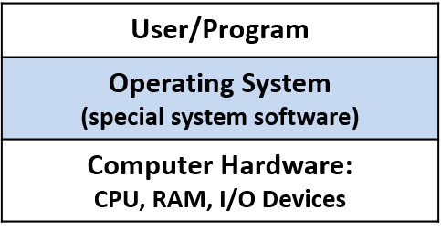

# 操作系统(The operating system)

操作系统是介于计算机硬件和计算机上运行应用程序之间的特殊系统软件层（见图1)。操作系统软件从开启电脑是运行，到关闭电脑时结束，其主要用于管理计算机硬件，以便高效的运行程序，以及方便用户使用计算机。

图1:操作系统位于计算机硬件与用户应用程序之间，用于管理计算机硬件以及便于硬件使用的相关抽象。

One of the ways in which the OS makes the computer hardware easy to use is in its support for initiating programs to run on the computer. Consider what happens when a user double-clicks an icon or types the name of a program executable at a shell prompt (e.g., ./a.out) to start a program running on the underlying system. The OS handles all the details of this operation, such as loading the program from disk into RAM and initializing the CPU to start running the program instructions; the OS hides from users these types of low-level actions that are necessary to run the user’s program on the computer.

One example of how the OS makes efficient use of system resources is by implementing multiprogramming, which means allowing more than a single program to run on the computer at a time. Multiprogramming does not necessarily mean that all the programs are running simultaneously on the computer hardware. In fact, the set of running programs in the system is typically much larger than the number of CPU cores. Instead, it means that the OS shares hardware resources, including the CPU, among several programs running on the system. For example, when one program needs data that are currently on disk, the OS can put another program on the CPU while the first program waits for the data to become available. Without multiprogramming, the CPU would sit idle whenever the program running on the computer accesses slower hardware devices. To support multiprogramming, the OS needs to implement an abstraction of a running program, called a process. The process abstraction enables the OS to manage the set of multiple programs that are running in the system at any given time.

Some example operating systems include Microsoft’s Windows, Apple’s macOS and iOS, Oracle’s Solaris, and open-source Unix variants such as OpenBSD and Linux. We use Linux examples in this book. However, all of these other general-purpose operating systems implement similar functionality, albeit sometimes in different ways.

The Kernel
The term operating system is often used to refer to a large set of system-level software that performs some kind of resource management and that implements "easy-to-use" abstractions of the underlying system. In this chapter, we focus on the operating system kernel; thus, when we use the term OS alone, we mean the OS kernel.

The OS kernel implements core OS functionality — the functionality necessary for any use of the system. This functionality includes managing the computer hardware layer to run programs, implementing and managing OS abstractions exported to users of the system (e.g., files are an OS abstraction on top of stored data), and implementing interfaces to the user applications layer and to the hardware device layer. The kernel implements mechanisms to enable the hardware to run programs and to implement its abstractions such as processes. Mechanisms are the "how" part of OS functionality. The kernel also implements policies for efficiently managing the computer hardware and for governing its abstractions. Policies dictate the "what," "when," and "to whom" part of OS functionality. For example, a mechanism implements initializing the CPU to run instructions from a particular process, and a policy decides which process gets to run next on the CPU.

The kernel implements a programming interface for users of the system: the system call interface. Users and programs interact with the OS through its system call interface. For example, if a program wants to know the current time of day, it can obtain that information from the OS by invoking the gettimeofday system call.

The kernel also provides an interface for interacting with hardware devices (the device interface). Typically, I/O devices such as hard disk drives (HDDs), keyboards, and solid-state drives (SSDs) interact with the kernel through this interface. These devices come with special device driver software that runs in the OS and handles transferring data to or from a specific device. The device driver software interacts with the OS through the OS’s device interface; a new device can be added to a computer system by loading its device driver code, written to conform to the OS’s device interface, into the OS. The kernel directly manages other hardware devices, such as the CPU and RAM. Figure 2 shows the OS kernel layer between the user applications and the computer hardware, including its programming interface to users and its hardware device interface.

OS kernel implements an interface to applications and to hardware devices
Figure 2. The OS kernel: core OS functionality necessary to use the system and facilitate cooperation between I/O devices and users of the system
In the rest of this chapter, we examine the role the operating system plays in running programs and in efficiently managing system resources. Our discussion is primarily focused on the mechanism (the "how") of the OS functionality and the implementation of two primary OS abstractions: a process (a running program) and virtual memory (a view of process memory space that is abstracted from its underlying physical storage in RAM or secondary storage).

